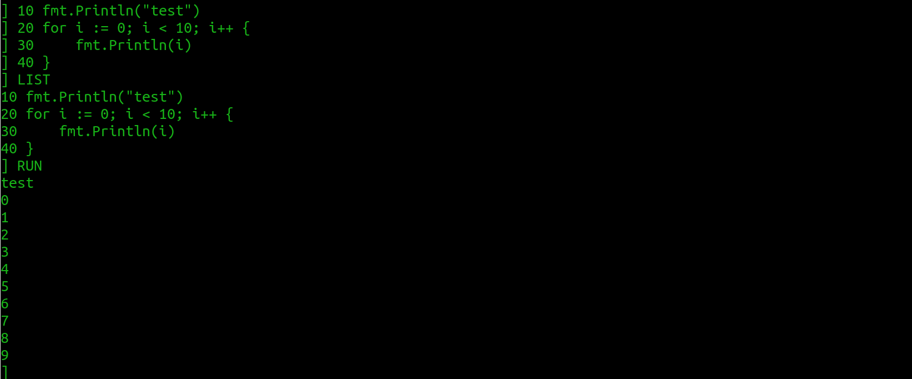

gostalgia
===



The goal of this project is to create a fun Go development environment that feels nostalgic for those that have used BASIC, Applesoft BASIC in particular and other old systems. This is a creative exercise, not an attempt to clone any one system.

**Fun over Functionality.**

# Run

```shell
go run main.go
```

# Planned features

* GR and HGR
* Beep
* Logo-style turtle graphics mode

What else would you like to see?

# Contribute

Feel free to suggest features by creating an issue. Also feel free to fork and submit PR's. :-)

# License

See `./LICENSE`.
